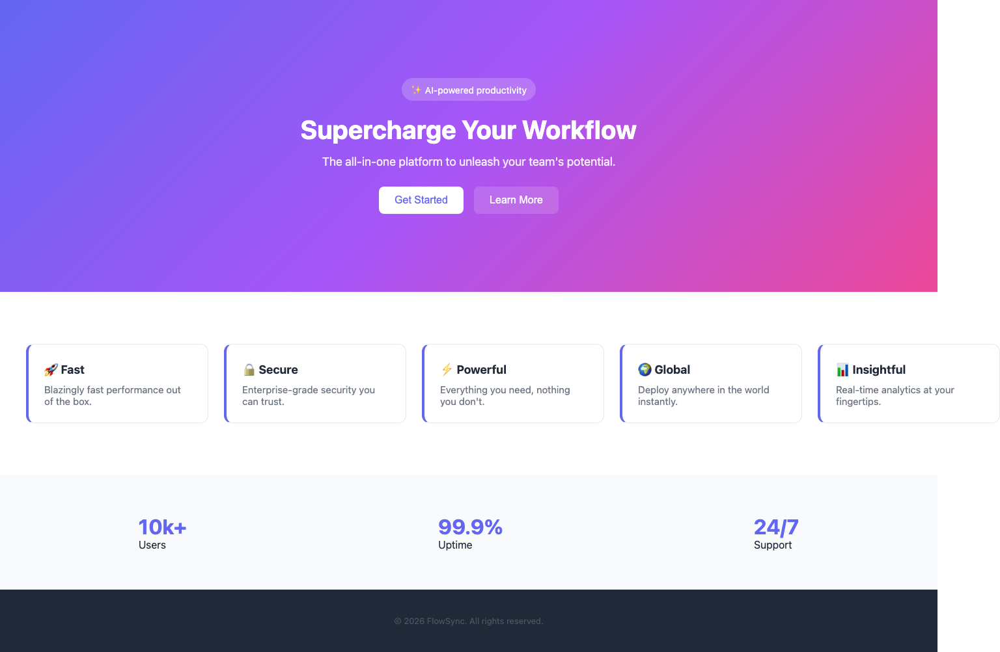
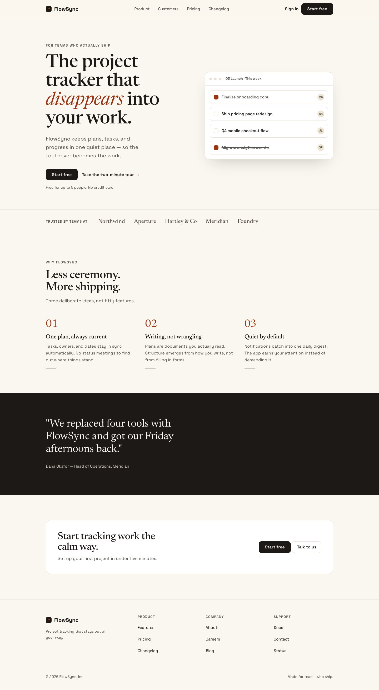

<!--
  Keywords (for search/discoverability): AI slop, AI-generated UI, anti-slop, visual QA,
  design QA, design review CLI, frontend design linter, screenshot scoring, rendered-pixel
  scoring, Playwright design audit, AI design checker, Cursor, Claude Code, v0, Lovable, Bolt,
  Replit, Windsurf, vibe coding, design system, accessibility, WCAG contrast, mobile overflow,
  CI design gate, LLM vision scoring, BYO key, npx CLI tool, web design quality.
-->

# PixelJury

### Make your AI-built site stop looking AI-built. 🎨

> Your code works — so why does the page still look like a robot made it? **PixelJury shows you
> exactly what's giving it away, hands your AI agent the fix, and proves the glow-up with a score.**

<p>
  <a href="https://www.npmjs.com/package/pixeljury"></a>
  <a href="https://github.com/gchahal1982/pixeljury/actions/workflows/ci.yml"></a>
  <a href="./LICENSE"></a>
  
  
  <a href="#contributing"></a>
</p>

You vibe-coded a site with Cursor, Claude Code, v0, Lovable or Bolt. It *works*. But it has
that look — the purple gradient hero, the Inter font, the emoji feature cards, the fake
"10k+ / 99.9% / 24-7" stats. **Generic. AI-made. Slop.**

**PixelJury is the taste your agent is missing.** It opens your running page, looks at the
actual pixels like a picky designer would, and tells you — specifically — what's making it look
cheap. Then it writes a ready-to-paste fix for your agent and gives you a design score so you
can *watch it get better*. One example below went from **16 → 84** in a single pass. ✨

No design degree, no Figma, no API key required. One command:

```bash
npx pixeljury review http://localhost:3000
```

⭐ **If "my AI site looks like AI made it" is a pain you've felt, star the repo** — it helps
others find it.

### Contents

[See it work (before/after)](#see-it-work--before--after) ·
[The iteration loop](#the-point-isnt-the-score--its-that-you-can-move-it) ·
[Quickstart](#quickstart) ·
[How it works](#how-it-works) ·
[Providers](#providers) ·
[The rubric](#the-rubric-is-open--argue-with-it) ·
[Who it's for](#who-its-for) ·
[FAQ](#faq) ·
[Contributing](#contributing) ·
[Roadmap](#roadmap)

**Why not just use a "design skill"?** Those help your agent *write* nicer code up front — but
they never see what actually shows up on screen. PixelJury is the second pair of eyes *after*
the page renders: it looks at the real pixels and catches the slop that slipped through. Use
both — generate with whatever you like, then let PixelJury tell you if it's actually good.

---

## See it work — before / after

Same product ("FlowSync"), judged by PixelJury. Both screenshots below are produced by the
tool's own render stage; both pages live in [`examples/`](./examples) so you can reproduce them.

| Before — `examples/sloppy-saas` | After — `examples/polished-saas` |
|:---:|:---:|
|  |  |
| **16 / 100 — Broken or pure slop** | **84 / 100 — Good, fixable gaps** |
| 3 hard fails · 6 slop-trope deductions | 0 hard fails · 0 deductions |
| ✗ mobile overflow · ✗ footer contrast · ✗ 42px touch target | ✓ responsive · ✓ AA contrast · ✓ 44px+ targets |
| ✗ Inter · gradient hero · emoji icons · left-border cards · 5× repeated cards · `✨ AI-powered` badge | ✓ committed editorial direction, none of the tropes |

Full per-dimension breakdowns: [`before.score.json`](./examples/gallery/before.score.json) ·
[`after.score.json`](./examples/gallery/after.score.json).

> The **screenshots**, **hard fails**, and **slop-trope deductions** are fully deterministic —
> reproducible with no API key. The 0–100 *headline* number also factors in a vision model's
> read of the six dimensions (the scores above are a Claude vision pass against rubric v0.1).
> The key-less `mock` provider still runs the whole deterministic half.

---

## The point isn't the score — it's that you can move it

A linter tells you what's wrong once. PixelJury gives you a **number you iterate against**: run
it, hand the `fix-prompt.md` to your agent, run it again, watch it climb. The same page above
went **16 → 84** in one pass — and it doesn't stop there.

| Iteration | Score | What moved it |
|---|:---:|---|
| **v0** — raw AI output | **16** | The generation you started with. 3 hard fails, every slop trope. |
| **v1** — after one `fix-prompt` pass | **84** | Killed the hard fails (responsive, AA contrast, 44px targets); dropped the gradient/emoji/fake-stats; committed to a real type + color system. |
| **v2** — the next pass (to break 90) | **90+** *(target)* | The critique PixelJury still surfaces: one distinctive layout move (Originality 80→88), let the accent carry the primary CTA (Hierarchy 84→90), swap in real customer logos (Polish). |

That loop — **review → fix → re-review** — is the product. The score is just how you know the
last change actually helped, and where the next 6 points are hiding.

---

## Quickstart

```bash
# point it at your running dev server
npx pixeljury review http://localhost:3000 --provider anthropic
```

```
  PixelJury  ·  rubric v0.1

  Design score: 61/100   — Generic AI output

  Hard fails
    ✗ Page is 70px wider than the 390px viewport (horizontal scroll on mobile)   caps at 70
    ✗ Text contrast 3.1:1 (needs 4.5:1) — e.g. "© 2026 FlowSync…"                caps at 65
  Problems
    ✗ "inter" is the primary typeface — an AI/template default        −5
    ✗ Large gradient background panel (1440×420px)                    −5
    ✗ The same card pattern is reused 5× — reads as templated         −5
    ✗ Pill/badge with AI-marketing copy — "✨ AI-powered…"            −3
    ✗ Layout & hierarchy weak                                         hierarchy 50

  → pixeljury/critique.md   pixeljury/fix-prompt.md   pixeljury/screenshot.png

  Run your agent on fix-prompt.md, then re-run to see the score move.
```

Then hand `pixeljury/fix-prompt.md` to your agent, let it rework the page, and run it again
to watch the score climb. **The before/after is the point.**

---

## What it produces

Every run writes to `./pixeljury/`:

| File | What it is |
|---|---|
| `screenshot.png` | full-page desktop render |
| `screenshot-390.png` | mobile (390px) render |
| `critique.md` | human-readable verdict with per-dimension scores |
| `fix-prompt.md` | agent-ready instructions, hard-fails-first |
| `score.json` | machine-readable result (for CI gating in 0.3) |

---

## How it works

```
[1 RENDER] → [2 STATIC SIGNALS] → [3 VISION SCORE] → [4 COMPOSE]
 Playwright    deterministic        BYO-key vision     rubric formula
 desktop+390   hard fails + tropes  6 weighted dims    → score.json + critique + fix-prompt
```

1. **Render** — headless Chromium loads your page; captures desktop + 390px screenshots and a
   DOM/CSS snapshot.
2. **Static signals** — deterministic, no LLM: contrast, mobile overflow, touch targets,
   tiny body text, overused fonts, gradient panels, repeated cards, AI-copy badges. These
   produce the reproducible **hard fails** and half the deductions, for free.
3. **Vision score** — your screenshots + the static summary + [the rubric](./rubric.md) go to
   a vision model, which scores the six weighted dimensions. **Bring your own key** — no
   PixelJury backend, no auth wall, no cost to us.
4. **Compose** — `composite − deductions`, capped by any hard fail, per the rubric formula.

The score is **not vibes**: every point traces to a rule in [`rubric.md`](./rubric.md).

---

## Providers

```bash
npx pixeljury review <url> --provider anthropic     # ANTHROPIC_API_KEY
npx pixeljury review <url> --provider openai        # OPENAI_API_KEY
npx pixeljury review <url> --provider gemini        # GEMINI_API_KEY
npx pixeljury review <url> --provider ollama        # local, no key (e.g. llama3.2-vision)
npx pixeljury review <url> --provider claude-code   # your Claude Code login (no API key)
npx pixeljury review <url> --provider codex         # your Codex / ChatGPT login (no API key)
npx pixeljury review <url> --provider mock          # deterministic, no key, no network
```

For the API providers, the key is read from `--key`, then `PIXELJURY_KEY`, then the standard
env var. Override the model with `--model`. With no key found, PixelJury falls back to `mock`
so it always runs end-to-end (the static signals are still real).

### Use your Claude Code or Codex subscription — no API key

If you already pay for Claude Code or Codex, PixelJury can score through the CLI you already
have logged in, instead of a separate metered key. It shells out to your local `claude` /
`codex` binary and uses **its** auth — PixelJury has no backend and never sees or stores your
credentials.

```bash
npx pixeljury review http://localhost:3000 --provider claude-code
npx pixeljury review http://localhost:3000 --provider codex
```

- **Claude Code** — works with a Pro/Max subscription (run `claude` once to sign in, or
  `claude setup-token` for a long-lived token). Point at a different binary with
  `PIXELJURY_CLAUDE_BIN`.
- **Codex** — works with a ChatGPT Plus/Pro/Business login (`codex` once to sign in).
  ⚠️ OpenAI recommends API-key auth (`--provider openai`) for automation and advises against
  subscription auth in public/CI contexts; `--provider codex` is best for individual use on
  your own machine and draws from your shared Codex quota. `PIXELJURY_CODEX_BIN` overrides the
  binary path.

> **Even better — let your agent run the loop.** Drop [`AGENTS.md`](./AGENTS.md) (Codex/Cursor)
> or the [`/pixeljury` slash command](./.claude/commands/pixeljury.md) (Claude Code) into your
> project, and your agent will review → fix → re-review until the score clears a threshold,
> on your existing subscription.

---

## The rubric is open — argue with it

[`rubric.md`](./rubric.md) is the scoring brain: six weighted dimensions (typography,
hierarchy, color, spacing, **originality**, polish), deterministic hard fails, and named
slop-trope deductions. Originality is the soul of it — *if someone was told AI built this,
would they believe it instantly?* — and it's the one thing a code linter structurally cannot
score.

**Disagree with a weight? Open a PR. The argument is the marketing.**

---

## Who it's for

- **Developers vibe-coding UIs** with Cursor, Claude Code, v0, Lovable, Bolt, Replit, or
  Windsurf who want a second opinion before they ship.
- **Indie hackers and solo founders** shipping landing pages fast and tired of the
  "generic AI SaaS" look.
- **Teams** that want a repeatable design-quality bar in code review and CI — a number on
  every frontend PR instead of "looks fine to me."
- **Anyone** who has looked at an AI-generated page and thought *this works, but it looks like
  AI made it.*

### Use cases

- Catch **AI slop** (gradient heroes, emoji icons, fake stats, templated cards) before launch.
- **Accessibility smoke test** — WCAG contrast, 44px touch targets, mobile overflow at 390px.
- **Design QA in CI** (0.3) — gate a PR under a score threshold.
- **Before/after proof** when your agent reworks a page — the score moves, and you can show it.

---

## Install / requirements

- Node ≥ 18. PixelJury uses Playwright; on first run install the browser once:
  ```bash
  npx playwright install chromium
  ```
- An API key for one of the providers above (or use `--provider ollama` / `mock`).

---

## Roadmap

- **0.1** ✅ `review` — render → score → critique → fix-prompt. *(you are here)*
- **0.2** — `fix`, `compare` (before/after image), the viral demo unit.
- **0.3** — GitHub Action + `--ci` score gating + `report` HTML + more vision adapters.
- **0.4** — custom rubric weights + a brand profile (score against *your* system, not a generic rubric).

---

## FAQ

**Is this a linter?** No. Static linters read your *code*. PixelJury renders the page and
judges the *pixels* — it can see that a hero looks generic, which no code rule can.

**Does it need an API key?** For the visual score, yes (OpenAI / Anthropic / Gemini), or run a
local model with Ollama. With no key it falls back to a `mock` provider — the deterministic
half (hard fails + slop tropes) still runs. **There's no PixelJury backend and no telemetry.**

**Does it work with Cursor / Claude Code / v0 / Lovable / Bolt?** Yes — PixelJury is agent- and
framework-agnostic. It judges whatever URL you give it and writes a `fix-prompt.md` any coding
agent can act on.

**Will it work on my framework?** It renders a URL in headless Chromium, so React, Vue, Svelte,
Next.js, Astro, plain HTML — anything that serves a page — all work.

**Is it free / open source?** MIT licensed, free, no account required.

**How is the score calculated?** Six weighted dimensions scored by a vision model, minus
deterministic slop deductions, capped by any hard fail. Every point traces to a rule in
[`rubric.md`](./rubric.md).

---

## Contributing

PRs and issues welcome — see [CONTRIBUTING.md](./CONTRIBUTING.md). The most valuable
contributions right now: **arguing with the rubric** (open a PR against [`rubric.md`](./rubric.md)),
new vision adapters, and before/after examples for the gallery.

⭐ **If PixelJury caught some slop for you, star the repo** — it's how other people find it.

---

## Development

```bash
npm install
npm test                 # deterministic engine + parser tests (no browser needed)
npx playwright install chromium
node packages/cli/bin/pixeljury.js review http://localhost:3000 --provider mock
```

Monorepo layout:

```
packages/cli      # npx entry + the `review` command + terminal report
packages/core     # Playwright render + static signals + score composer
packages/vision   # BYO-key vision adapters + structured-output parsing
rubric.md         # the scoring brain (ships in the repo)
examples/         # before/after gallery + a runnable sloppy-saas demo page
```

---

## License

MIT © PixelJury contributors

<sub>
<b>Keywords:</b> AI slop · anti-slop · visual QA for AI frontends · AI-generated UI checker ·
design QA CLI · rendered-pixel design scoring · frontend design linter · screenshot design
review · Playwright design audit · Cursor / Claude Code / v0 / Lovable / Bolt / Replit /
Windsurf · vibe coding · design system · WCAG contrast · mobile overflow · CI design gate ·
LLM vision scoring · npx tool · web design quality.
</sub>
